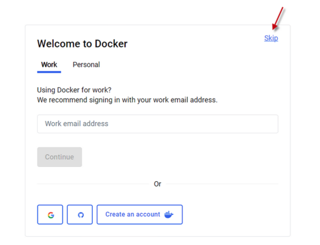
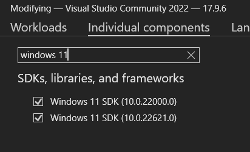
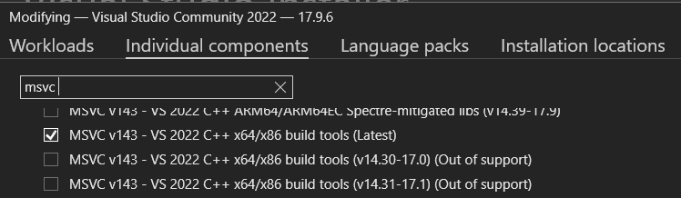

# Development Environment

The clover dev relies on [Dev Containers](https://containers.dev/) to maintain a consistent programming environment
across all developer machines, regardless of operating system. This guide contains all setup necessary
to 1) build and flash firmware, 2) run Python scripts for data processing or other utilities, and 3)
contribute code.

This guide is intended to be comprehensible for any engineer, even if they have limited programming
background.

## Local setup

### Install Docker Desktop

Docker Desktop provides a lightweight virtual machine-esque Linux environment for any desktop platform,
which is the backing technology for Dev Containers. Install it
as [this link](https://www.docker.com/products/docker-desktop/).

=======
Open Docker Desktop, and click through the setup. **Do not create an account if it asks you, instead click skip.**



### Install an IDE

Dev Containers rely heavily on an IDE, or Integrated Development Environment, for a smooth experience.
It is the primary means through which you'll write code and run programs.

If you are doing work in C++ with Zephyr, I highly recommend installing CLion, which you may do
from [this link](https://www.jetbrains.com/clion/download). Unlike Visual Studio Code,
it includes first-party support for Zephyr and for embedded debugging toolchains. Although it is
a paid app, they offer a free [educational license](https://www.jetbrains.com/shop/eform/students) for university
students.

If you only need this environment for light programming and scripting, consider installing Visual Studio Code
at [this link](https://code.visualstudio.com/download).

### Install git

git is a tool used to manage software collaboration. Install it [here](https://git-scm.com/install/). 

### Build flasherd

flasherd is a program that runs in the background of your computer
=======
### Install git

git is a tool used to manage software collaboration. Install it [here](https://git-scm.com/install/).

### Build flasherd

flasherd is a program that runs in the background of your computer, communicating with the inside of the dev container
to send flash commands to microcontrollers.

#### (Windows only) Install build dependencies

Follow [these instructions](https://learn.microsoft.com/en-us/cpp/build/vscpp-step-0-installation?view=msvc-170#visual-studio-2022-installation)
to install the Microsoft Visual Studio installer.

Run the installer, and either install it from scratch or modify an existing installation. Under "individual
components," ensure that you have Windows 11 SDK and Microsoft Visual C++ for x86_64 installed.





#### Install Rust

Install Rust via [rustup](https://rustup.rs/). Use all defaults for the installation.

Then, relaunch this repository in a dev container. Your IDE should automatically run a command to build and run
`flasherd`. IntelliJ on Windows doesn't do this correctly, so you may need to run it yourself from the `clover`
directory:

```shell
# On host
cargo run --bin flasherd_cleaner --release && cargo run --bin flasherd --release -- "/path/to/clover" --daemonize
```

**Example:**

```text
C:\Users\james\lpl-flightsoft>cargo run --bin flasherd_cleaner --release && cargo run --bin flasherd --release -- "c:\Users\james\lpl-flightsoft" --daemonize
   Compiling flasherd v0.1.0 (C:\Users\james\lpl-flightsoft\flasherd)
    Finished `release` profile [optimized] target(s) in 0.82s
     Running `target\release\flasherd_cleaner.exe`
[flasherd-cleaner] No flasherd matching pid 42768 found, is it already dead?
   Compiling flasherd v0.1.0 (C:\Users\james\lpl-flightsoft\flasherd)
    Finished `release` profile [optimized] target(s) in 3.42s
     Running `target\release\flasherd.exe c:\Users\james\lpl-flightsoft --daemonize`
Spawned flasherd with pid: 18152
```

If successful, you should see the following when you start a terminal in the dev container:

```text
   __   ___  __
  / /  / _ \/ /                                                                                                                                                                                                                                                                                                     
 / /__/ ___/ /__                                                                                                                                                                                                                                                                                                    
/____/_/  /____/                                                                                                                                                                                                                                                                                                    
Welcome!                                                                                                                                                                                                                                                                                                            
flasherd is active.
lpl@docker-desktop ~/clover Δ 
```

Afterwards, you can test your connection within the dev container by running:

```shell
flasherd-client --command-windows echo --command-macos echo --command-linux echo --arg hello
```

**Example:**

```
lpl@docker-desktop ~/clover Δ scripts/flasherd-connection-test.sh
[flasherd-connection-test] Testing flasherd...
[flasherd-client] Received args: ["--command-windows", "echo", "--command-macos", "echo", "--command-linux", "echo", "--arg", "hello"]
[flasherd-client] Connecting to host flasherd at port 6767
hello
[flasherd-client] Terminated naturally with status code 0
[flasherd-connection-test] flasherd is up!
```

## Test build and flash

Run the following to build the `throttle` application:

```shell
west build -p auto throttle -b throttle_legacy
```

Press the large white reset button on the Teensy. Then, run the following to flash:

```text
lpl@docker-desktop ~/clover Δ west flash                                                                                                                                                                                                                                                                            
-- west flash: rebuilding
ninja: no work to do.                                                                                                                                                                                                                                                                                               
-- west flash: using runner tycmd_flasherd
-- runners.tycmd_flasherd: Flashing file: /home/lpl/clover/build/zephyr/zephyr.hex                                                                                                                                                                                                                                  
[flasherd-client] Received args: ["--command-windows", "C:\\Program Files (x86)\\TyTools\\tycmd.exe", "--command-macos", "tycmd", "--command-linux", "tycmd", "--arg", "upload", "--arg", "--nocheck", "--arg-path", "/home/lpl/clover/build/zephyr/zephyr.hex"]                                                    
[flasherd-client] Connecting to host flasherd at port 6767
      upload@17271870-Teensy  Uploading to board '17271870-Teensy' (Teensy 4.1)
      upload@17271870-Teensy  Firmware: zephyr.hex
      upload@17271870-Teensy  Flash usage: 93 kiB (1.2%)
      upload@17271870-Teensy  Uploading...
      upload@17271870-Teensy  Sending reset command (with RTC)
      upload@17271870-Teensy  Board '17271870-Teensy' has disappeared
[flasherd-client] Terminated naturally with status code 1
ERROR: runners.tycmd_flasherd: Failure 1
```

The board should start flashing at a slow, 1-second period, indicating that it's awaiting serial connection.

Open TyCommander, select the board, and enable serial logging. Once the serial console connects, the LED should start
quickly flashing as the application runs.

To rebuild and reflash, simply press the reset button and run `west flash`. As long as TyCommander is open, it should
reconnect serial automatically.

To connect to the test command server, run:

```shell
nc 169.254.99.99 19690
```

And to ensure the output is saved to a file, run:

```shell
nc 169.254.99.99 19690 | tee out.log
```

## Troubleshooting

### Build fails due to `<...>.h`: No such file or directory

**Example**:

```text
/home/lpl/zephyr/include/zephyr/sys/util.h:31:10: fatal error: string.h: No such file or directory
   31 | #include <string.h>
      |          ^~~~~~~~~~
compilation terminated.
ninja: build stopped: subcommand failed
```

Ensure that the C/C++ compiler used is from the Zephyr SDK.

**Incorrect CMake output**:

```text
-- Found toolchain: cross-compile (/usr/bin/arm-none-eabi-)
...
-- C compiler: /usr/bin/arm-none-eabi-gcc
-- C++ compiler: /usr/bin/arm-none-eabi-g++
```

This can be fixed by ensuring the `ZEPHYR_TOOLCHAIN_VARIANT` environment variable is set to `zephyr`. IDE tools may not
correctly pick this up, but it i.

**Correct CMake output**:

```text
-- Found host-tools: zephyr 0.17.2 (/home/lpl/zephyr-sdk-0.17.2)
-- Found toolchain: zephyr 0.17.2 (/home/lpl/zephyr-sdk-0.17.2)
...
-- C compiler: /home/lpl/zephyr-sdk-0.17.2/arm-zephyr-eabi/bin/arm-zephyr-eabi-gcc
-- C++ compiler: /home/lpl/zephyr-sdk-0.17.2/arm-zephyr-eabi/bin/arm-zephyr-eabi-g++
```
